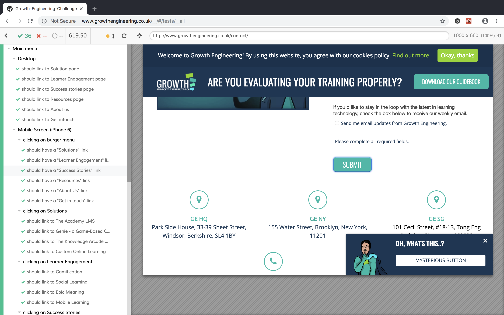

# CHALLENGE: 

Write Automated tests for http://www.growthengineering.co.uk/ 

**Scenario 1**: Check that all menu links in the top navigation work (Solutions to Get in Touch) 

**Scenario 2**: Check that form validation works on the contact page (/contact/), but please avoid submitting any data. 

# The test suite

I have built the test using [Cypress](https://www.cypress.io/). The suite contains 36 tests.

## To run the cypress test

Go to main directory, run `npm install` then `npm start`.

To run them on a headless browser: `npm run headless`

## Some notes

- Since the implementation of the menu is different between mobile screens and larger screens, the tests were broken into suites to accommodate differences
    - On desktop, clicking on the top-level links on the menu takes the User to a page
    - On mobile, the top-level links only toggle the submenu (the submenu items then take the user to the page)